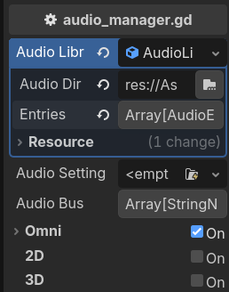
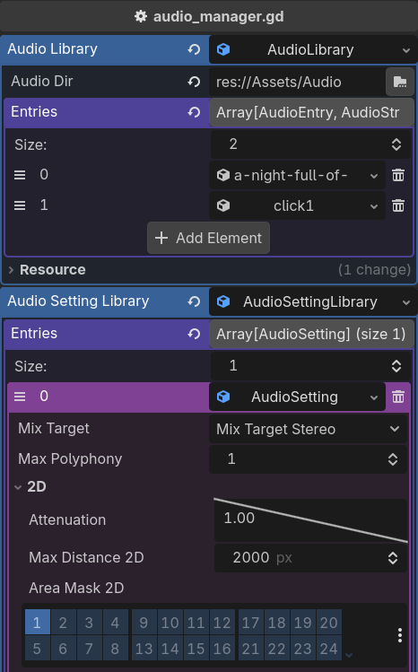
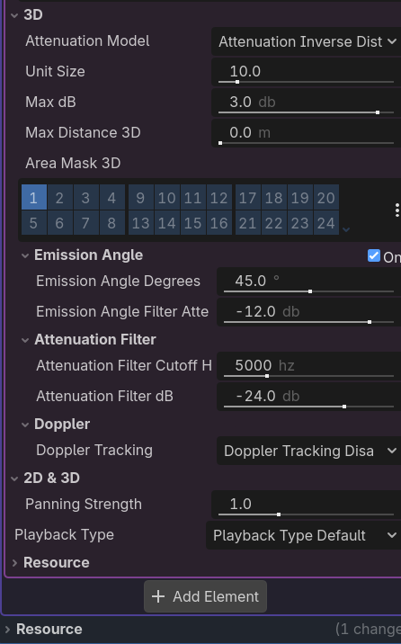
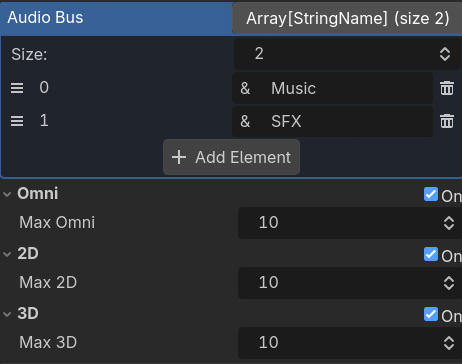
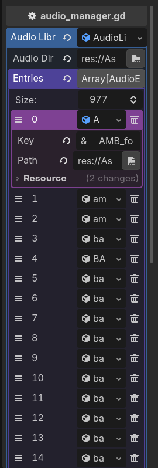
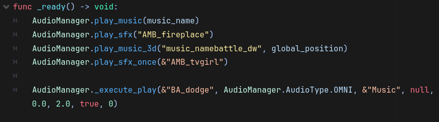

Any AudioManager is a global plugin for managing any audiotype(Omni, 2D, and 3D) efficiently in Godot. It automatically create dictionary and cache, and can be called with simple function. 

list of function to use: 

```
is_playing(key: StringName) -> bool

play_sfx_once(key: StringName, volume: float = 0.0, pitch: float = 1.0, audio_setting_index: int = -1) -> void

play_sfx(key: StringName, volume: float = 0.0, pitch: float = 1.0, audio_setting_index: int = -1) -> void

play_sfx_2d(key: StringName, pos: Vector2, volume: float = 0.0, pitch: float = 1.0, audio_setting_index: int = -1) -> void

play_sfx_3d(key: StringName, pos: Vector3, volume: float = 0.0, pitch: float = 1.0, audio_setting_index: int = -1) -> void

play_music(key: StringName, loop: bool = true, volume: float = 0.0, pitch: float = 1.0, audio_setting_index: int = -1) -> void

play_music_2d(key: StringName, pos: Vector2, loop: bool = true, volume: float = 0.0, pitch: float = 1.0, audio_setting_index: int = -1) -> void

play_music_3d(key: StringName, pos: Vector3, loop: bool = true, volume: float = 0.0, pitch: float = 1.0, audio_setting_index: int = -1) -> void

stop_music() -> void

stop_by_key(key: StringName) -> void

stop_all_active() -> void  
```

Or if you want to use audio setting or other things, you can modify the script, add wrapper function, and use the audio setting index :

```
_execute_play(key: StringName, type: AudioType, bus: StringName, pos: Variant, volume: float = 0.0, pitch: float = 1.0, loop: bool = false, audio_setting_index: int = -1) -> void  
```

License is CC0, credit is appreciated but not required.

Screenshots :

<p align="center">
	
	
	
	
	
	
</p>
